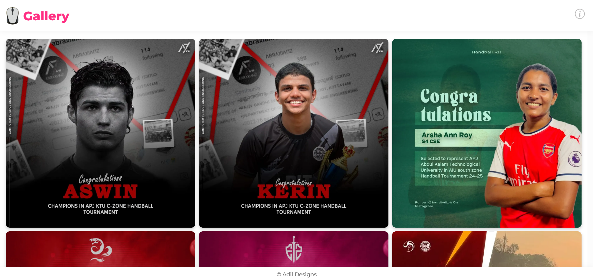

# 🎨 Designs

A simple website showcasing my design works. The website is built using **HTML, CSS, and JavaScript** and is deployed on **GitHub Pages**.

## 🌐 Live Demo
🔗 [View the website here](https://your-github-username.github.io/Designs/)  

## 🚀 Features
- Displays design works in a clean gallery format  
- Responsive layout

## 📷 Preview
  

## 🛠️ Technologies Used
- **HTML** - Structure of the website  
- **CSS** - Styling and layout  
- **JavaScript** - Interactive features  

## 📂 How to Use
1. Clone the repository:  
   ```sh
   git clone https://github.com/your-github-username/Designs.git

2. Navigate to the project folder:
   ```sh
   cd Designs

3. Open index.html in your browser.

## 📝 License
This project is **open-source** and free to use.

## 🔗 Connect with Me
If you like my work, feel free to connect! 🚀
